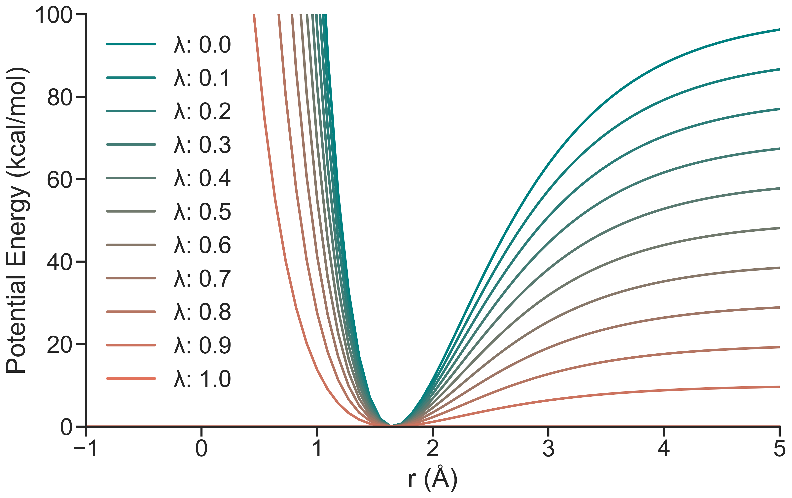
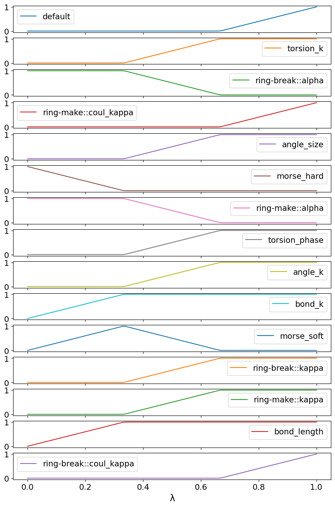

# Theory

Alchemical bond creation or annihilation calculations are challenging due to the harmonic potentials that are used to describe bonded interactions in molecular mechanics. The quadratic nature of the potential means that if the bond is being annihilated as a function of $\lambda$, the conformations sampled at $\lambda=1$ will have extremely high potential energy under other values of $\lambda$, as these conformations will more than likely sample $r$ values well outside $r0$ (equilibrium bond distance).

To address this, various approaches have been developed over the years, such as the [soft-bond potential](https://pubs.acs.org/doi/10.1021/acs.jctc.6b00991) and [auxiliary restraints approach](https://pubs.acs.org/doi/full/10.1021/acs.jctc.1c00214) for example.

In SOMD2, we instead utilize alchemical Morse potentials which plateau at a predefined dissociation energy ($D_E$) value when $r \gg r0$, thus smoothening the Hamiltonian change over large distances.



The Morse potential is implemented in the [sire.restraints](https://sire.openbiosim.org/api/restraints.html#module-sire.restraints) module. To use the Morse potential effectively and enable the bond annihilation and creation calculations within SOMD2, we also need to use specialised lambda schedules which will perform our calculation in a sequence of steps, as a function of $\lambda$. 

In SOMD2 configuration, this is controlled by the `lambda_schedule`. For simulations that involve bond annihilations as a function of $\lambda$, we have to use `ring_break_morph` schedule, which looks like this:



This might look a bit overwhelming at first, but this $\lambda$ schedule essentially carries out 3 alchemical operations in distinct stages:

Before the simulation even starts, the Morse restraint implementation will automatically detect the bond that is being annihilated/created during the transformation and replace it with a `morse_hard` force, which is meant to mimic the energetic and conformational restraining contributions of the original harmonic bond.

1. `potential_swap` ($0 - 0.33 \space \lambda$) stage: Here we have a `morse_hard` force which goes from 1 to 0. Simultaneously, we also have the `morse_soft` force which goes from 0 to 1 (hence the `potential_swap`). The purpose of the `morse_soft` force is to transfer the bond into a smoother, softer Morse potential, the values of which have been parametrized previously to enable efficient bond annihilation/creation transformations. In addition, `bond_k` and `bond_length` forces go from 0 to 1, meaning that we fully perturb the bond force constants lengths in our perturbable molecule.
2. `restraints_off` ($0.34 - 0.66 \space \lambda$) stage: Here the `morse_soft` goes from 1 to 0, meaning that it is inactive at the end of this stage. We also perturb the remaining bonded parameters, such as the `angle` and `torsion` forces, as well as deal with the soft-core forces (`ring-make` and `ring-break` respectively).
3. `morph` ($0.67 - 1.00 \space \lambda$) stage: Here we perturb the rest of the remaining parameters in the molecule, mainly the non-bonded parameters at this stage (controlled by the `default` lever).

In the end we have carried out a sequence of the alchemical operations use two Morse bond forces to smoothly annihilate/create a bond during a transformation.

Have a look at the [Sire's Merged Molecules and Lambda Levers tutorial](https://sire.openbiosim.org/tutorial/index_part07.html) to learn more about how Sire can be used to handle alchemical perturbations in a granular, force-specific way.

---

# Instructions

Now that we have built a perturbable SOMD2 system file, [unlike in the previous protein FEP tutorials](../../mdm2-e23g-mutation/), we only have 1 way of running the SOMD2 simulation, that is, by using the SOMD2 Python API. This is because we need to create and pass alchemical Morse potential restraints to SOMD2, and the only way to do that is using `sire.restraints.morse_potential()` functionality. 

The tutorial provides `edge_runner_somd2.py` that shows an example of how to run an bond creation transformation. The most important section of this script is the Morse restraint creation part:

```python
hard_restraints, sire_system = sr.restraints.morse_potential(
    sire_system,
    de="150 kcal mol-1",
    auto_parametrise=True,
    direct_morse_replacement=True,
    name="morse_hard",
)

soft_restraints, _ = sr.restraints.morse_potential(
    sire_system,
    atoms0=hard_restraints[0].atom0(),
    atoms1=hard_restraints[0].atom1(),
    r0=hard_restraints[0].r0(),
    k=f"{bond_strength} kcal mol-1 A-2",
    auto_parametrise=False,
    de=f"{de_strength} kcal mol-1",
    name="morse_soft",
    )
```
Let's break down what is happening here.

1. Setting up the "Hard" Restraint (`morse_hard`)
First, we apply a stiff Morse potential to replace the standard harmonic bond that is being transformed.

    `auto_parametrise=True` and `direct_morse_replacement=True`: These are the key workhorses. Instead of manually specifying which atoms to restrain, the code automatically detects the bond undergoing the alchemical transformation and replaces its harmonic potential **directly** with a Morse potential. The direct part means that the original harmonic potential is removed from the molecule.

    `de="150 kcal mol-1"`: We set a very high dissociation energy (well depth). This ensures the potential is "hard" and closely mimics the tight confinement and energetic profile of the original harmonic bond near its minimum. The `k` value is directly matched to the original harmonic potential.

    The function returns the generated `hard_restraints` and the updated `sire_system` where the original harmonic potential is now deleted.

2. Setting up the "Soft" Restraint (`morse_soft`)
Next, we create a second, weaker Morse potential that will act as the soft restraint during the actual transformation.

    Borrowing Geometry: Instead of auto-detecting the bond again, we explicitly pass `atoms0`, `atoms1`, and the equilibrium distance (`r0`) straight from the `hard_restraints[0]` object we just created. This guarantees both restraints act on the exact same atoms with the exact same reference distance.

    `auto_parametrise=False`: Because we are explicitly providing the geometry and parameters from the hard restraint, we turn off auto-parametrisation.

    `k` and `de`: We apply custom, user-defined variables (`bond_strength` and `de_strength`) to set the force constant and well depth, allowing this potential to be softer and more easily bridged during the alchemical transformation.

Later on in the script, we pass these restraints into SOMD2 configuration:

```python
somd2_config.restraints = [hard_restraints, soft_restraints]
```

We also select appropriate lambda schedule for the transformation:

```python
somd2_config.lambda_schedule = "reverse_ring_break_morph"
```

> [!Caution]
> Since we are doing a transformation that involves an alchemical creation of the bond (Leu-to-Pro mutation), we use the predefined `reverse_ring_break_morph` here. If we were doing a transformation which involved a bond annihilation (Pro-to-Leu mutation), we would be using the `ring_break_morph` instead. The Morse force setup remains identical regardless of which lambda schedule is used. If you use an incorrect lambda schedule for the type of the transformation that you're doing the code will perform a validation check and throw an error to stop from an incorrect setup from running.

For the `morse_soft` `k` and `de` parameters, we use default values of `125 kcal mol-1 A-2` and `50 kcal mol-1` respectively, as these values have been found to work well for a broad range of bond transformations.

If you are ready, you can run the script with following:

```bash
python edge_runner_somd2.py --de_strength 50 --bond_strength 125 --replicate 1
```

In the terminal output we will see that SOMD2 has automatically detected the bond which will be alchemically created and setup the two Morse forces: 

```python
MorsePotentialRestraints( name=morse_hard, size=1, use_pbc=use_pbc=False
0: MorsePotentialRestraint( 207 <=> 210, k=620 kcal mol-1 Å-2 : r0=1.526 Å : de=150 kcal mol-1 )
)
MorsePotentialRestraints( name=morse_soft, size=1, use_pbc=use_pbc=False
0: MorsePotentialRestraint( 207 <=> 210, k=125 kcal mol-1 Å-2 : r0=1.526 Å : de=50 kcal mol-1 )
)
...
```

When the simulation is complete, head over to the [03_analysis](../03_analysis/) to analyse the simulation results.